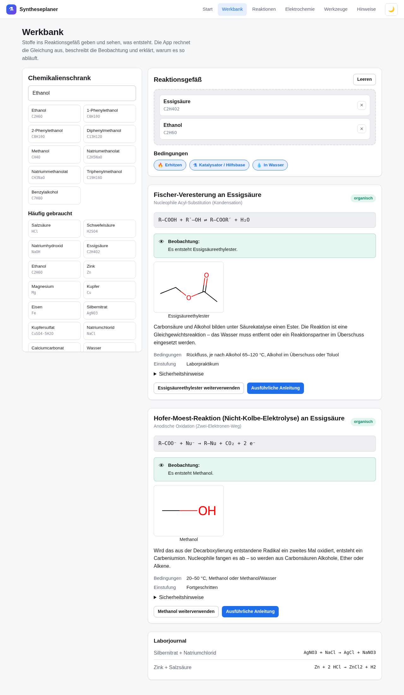

# Syntheseplaner

Eine App für **Windows** und **iPad**, die aus einem eingegebenen Stoff passende
chemische Synthesen und Reaktionen vorschlägt – mit Reaktionsgleichung,
Reaktionsmechanismus, vollständiger Arbeitsanleitung, Sicherheitshinweisen und
elektrochemischen Kennzahlen. Dazu eine **Werkbank**, in der sich Stoffe
zusammengeben lassen, und ein Katalog aus **5498 berechneten Synthesen**.



*Werkbank: Essigsäure und Ethanol im Reaktionsgefäß, mit Gleichung, Produktstruktur und Erklärung.*

## Was die App kann

**Werkbank: Stoffe zusammengeben und sehen, was entsteht.**
Im Chemikalienschrank stehen 653 Stoffe bereit. Bis zu vier davon wandern ins
Reaktionsgefäß, dazu lassen sich Bedingungen einstellen – erhitzen, Katalysator,
wässrige Lösung. Die App liefert dann:

- die **ausgeglichene Reaktionsgleichung** und, wo sinnvoll, die Ionengleichung
- die **Beobachtung**: welche Farbe der Niederschlag hat, ob es sprudelt, was man riecht
- eine **Erklärung**, warum die Reaktion so abläuft
- die **Struktur des Produkts**, gezeichnet aus der berechneten Formel
- bei Bedarf den Hinweis, **was noch fehlt** (Wärme, Katalysator, Elektrolysezelle)
- und wenn nichts passiert: **warum** nicht – etwa weil das Metall edler als
  Wasserstoff ist oder alle Ionen in Lösung bleiben

Jedes Produkt lässt sich mit einem Tipp als neues Edukt übernehmen, sodass sich
mehrstufige Synthesen durchspielen lassen. Das Laborjournal hält fest, was man
schon probiert hat.

**Synthesekatalog: 5498 Wege zu 2008 Stoffen.**
Für jeden Stoff nachschlagen, wie er hergestellt wird. Der Katalog ist nicht
abgeschrieben, sondern gerechnet: Jede der 87 Reaktionsvorlagen wird auf alle
passenden Stoffe der Datenbank angewendet und das Produkt mit RDKit bestimmt;
die anorganischen Gleichungen entstehen aus dem Ionenmodell und sind exakt
ausgeglichen. Auf jeder Stoffseite stehen deshalb «So wird X hergestellt» und
«X als Ausgangsstoff».


**Stoff eingeben → Reaktionen erhalten.** Name, Summenformel, CAS-Nummer oder
SMILES eingeben. Die App erkennt die funktionellen Gruppen im Molekül und
schlägt dazu passende Reaktionen vor, sortiert nach Passgenauigkeit.

**Produkte werden wirklich berechnet.** Zu jeder Reaktion ist eine
Reaktionsvorschrift als Reaktions-SMARTS hinterlegt. Die App wendet sie mit
RDKit auf die eingegebene Struktur an und zeichnet das Produkt – sie zeigt also
nicht nur ein Lehrbuchbeispiel, sondern *dein* Molekül.

**Anschauliche Anleitungen.** Antippen einer Reaktion öffnet die Detailansicht:

- **Übersicht** – Gleichung als Strukturformel, Reagenzien mit Äquivalenten,
  Bedingungen von der Temperatur bis zur Aufarbeitung, Quellenangaben
- **Anleitung** – nummerierte Arbeitsschritte mit Warnungen und Praxistipps,
  dazu ein Ansatzrechner, der aus der Einwaage alle Reagenzienmengen ableitet
- **Mechanismus** – Teilschritte einzeln gezeichnet, mit beschriebenem
  Elektronenfluss, Zwischenstufen und schematischem Energieprofil
- **Sicherheit** – GHS-Piktogramme, H-Sätze, Schutzausrüstung, Entsorgung
- **Elektrolyse** – bei elektrochemischen Reaktionen: Elektrodenmaterial,
  Stromdichte, Ladungsbedarf in F/mol, Stromausbeute und ein Faraday-Rechner

**Reaktionen suchen.** Volltextsuche über alle Reaktionen mit Filtern nach
Kategorie, funktioneller Gruppe und Einsatzbereich.

**Elektrochemie.** Spannungsreihe mit 65 Halbzellen, Nernst-Rechner,
Zellspannung mit ΔG und Gleichgewichtskonstante, Faradaysche Gesetze und
spezifischer Energiebedarf.

**Werkzeuge.** Reaktionsgleichungen ausgleichen (auch Ionengleichungen mit
Ladungsbilanz), Redoxgleichungen nach der Halbreaktionsmethode in saurem und
basischem Milieu, Oxidationszahlen, Molmassen, Elementaranalyse,
Unterschussreagenz, Ausbeute, Verdünnungen und Maßlösungen.

## Datenbestand

| | |
|---|---|
| berechnete Synthesen | 5498 |
| davon organisch / anorganisch | 3490 / 2008 |
| verschiedene Zielstoffe | 2008 |
| Reaktionstypen mit Mechanismus | 87 |
| davon elektrochemisch | 15 |
| Stoffe offline verfügbar | 653 |
| Standardpotentiale | 61 |
| erkannte funktionelle Gruppen | 34 |
| Elemente mit Atommassen | 118 |

Darüber hinaus sind alle Stoffe aus **PubChem** abrufbar, sobald eine
Internetverbindung besteht.

## Installation

### iPad

1. Die Adresse der App in **Safari** öffnen (nur Safari kann installieren).
2. Auf das **Teilen-Symbol** tippen (Quadrat mit Pfeil nach oben).
3. **«Zum Home-Bildschirm»** wählen.

Die App startet danach im Vollbild und funktioniert offline – inklusive
Strukturberechnung, Reaktionsdatenbank und aller Rechner. Nur die PubChem-Suche
braucht Netz.

### Windows

**Variante 1 – als App aus dem Browser:** Seite in Edge oder Chrome öffnen,
Menü → «Apps» → «Diese Website als App installieren».

**Variante 2 – als Installer:** Der GitHub-Actions-Workflow `build.yml` erzeugt
bei jedem Push eine `.msi` und eine `.exe` als Artefakt; ein Versionstag
(`v1.0.0`) legt zusätzlich eine Veröffentlichung an. Lokal:

```bash
npm install
npm run tauri:build      # Ergebnis in src-tauri/target/release/bundle/
```

Dafür werden [Rust](https://rustup.rs/) und die
[Tauri-Voraussetzungen](https://tauri.app/start/prerequisites/) benötigt.

## Entwicklung

```bash
npm install
npm run dev        # Entwicklungsserver auf http://localhost:5173
npm test           # 209 Tests (Chemiekern, Reaktionen, Werkbank, Katalog)
npm run lint       # Typprüfung
npm run catalog    # Synthesekatalog neu berechnen (rund 13 s)
npm run build      # Produktionsbuild nach dist/
```

Rauchtest der gebauten App im Browser:

```bash
npm run build
npx vite preview --port 4173 &
node scripts/smoke-test.mjs
```

## Aufbau

```
src/
  chem/           Fachlicher Kern – ohne Oberflächenbezug, vollständig getestet
    elements.ts       118 Elemente mit Atommassen
    formula.ts        Summenformel-Parser (Klammern, Hydrate, Ladungen)
    balance.ts        Gleichungsausgleich über den Nullraum der Elementmatrix
    fraction.ts       Exakte Bruchrechnung auf BigInt-Basis
    redox.ts          Oxidationszahlen und Halbreaktionsmethode
    electro.ts        Nernst, Zellspannung, Faradaysche Gesetze
    stoichiometry.ts  Ansatzplanung, Unterschuss, Ausbeute, Verdünnung
    ions.ts           Ionenmodell, Löslichkeitsregeln, Spannungsreihe
    inorganicRules.ts Anorganische Reaktionsregeln mit Beobachtungen
    workbench.ts      Werkbank: Was entsteht aus diesen Stoffen?
    rdkit.ts          Anbindung der RDKit-WebAssembly-Bibliothek
    reactionEngine.ts Gruppenerkennung, Produktberechnung, Vorschläge
    safety.ts         Reglementierte Stoffe und gefährliche Mischungen
  data/           Wissensdatenbank
    reactions/        Reaktionen nach Stoffklassen getrennt
    substanceTables/  Erweiterte Stofftabellen
    generated/        Erzeugter Synthesekatalog (catalog.json)
    functionalGroups.ts  SMARTS-Muster der funktionellen Gruppen
    substances.ts     Offline-Stoffdatenbank
    potentials.ts     Elektrochemische Spannungsreihe
    catalog.ts        Zugriff und Suche im Synthesekatalog
  services/       PubChem-Anbindung mit Ratenbegrenzung und Cache
  components/     Wiederverwendbare Bausteine der Oberfläche
  pages/          Die neun Seiten der App
scripts/
  build-catalog.ts  Erzeugt den Synthesekatalog
src-tauri/        Windows-Anwendung (Tauri v2)
docs/             Fachliche Grundlagen und Entwicklungshinweise
```

Mehr dazu: [Fachliche Grundlagen](docs/CHEMIE.md) ·
[Entwicklungshinweise](docs/ENTWICKLUNG.md)

## Woher die Daten stammen

- **Stoffdaten:** [PubChem](https://pubchem.ncbi.nlm.nih.gov/) (National Library
  of Medicine) über PUG REST und PUG View, ergänzt um eine mitgelieferte
  Offline-Datenbank
- **Strukturberechnung:** [RDKit](https://www.rdkit.org/) als WebAssembly-Modul –
  läuft vollständig auf dem Gerät, es werden keine Strukturen verschickt
- **Reaktionen und Mechanismen:** kuratiert nach Organikum, Clayden *Organic
  Chemistry*, Hollemann-Wiberg, *Ullmann's Encyclopedia of Industrial Chemistry*
  und den bei jeder Reaktion angegebenen Originalarbeiten

## Sicherheit

Die Anleitungen sind **Lern- und Planungsmaterial, keine Freigabe zum
Experimentieren.** Chemische Synthesen gehören in ein dafür eingerichtetes Labor,
mit Gefährdungsbeurteilung, Aufsicht und Absaugung. Verbindlich sind immer die
Sicherheitsdatenblätter der Hersteller und die Regeln der jeweiligen Einrichtung.

Für Stoffgruppen mit ausschließlich schädigender Verwendung – chemische
Kampfstoffe, Explosivstoffe, Betäubungsmittel – zeigt die App bewusst **keine**
Synthesevorschriften. Eigenschaften und Gefahrenhinweise bleiben abrufbar.

## Grenzen

Die Vorschläge beruhen auf Mustererkennung: Die App prüft, ob die passende
funktionelle Gruppe vorhanden ist, und wendet die hinterlegte Vorschrift an. Sie
berücksichtigt weder Sterik noch Schutzgruppen, konkurrierende Gruppen im selben
Molekül oder die tatsächliche Reaktivität. Ein berechnetes Produkt ist ein
Vorschlag, kein Versprechen.

Für die Werkbank heißt das: Findet sie keine Reaktion, ist das **kein Beweis**,
dass nichts passiert – die Datenbank deckt die gängigen Reaktionstypen ab, nicht
jede denkbare Umsetzung. Umgekehrt bedeutet ein angezeigtes Produkt nicht, dass
die Reaktion unter beliebigen Bedingungen abläuft; deshalb nennt die App, was an
Wärme, Katalysator oder Apparatur noch fehlt.

Der Synthesekatalog enthält zu jedem Produkt die Wege, die sich aus den
hinterlegten Vorlagen ergeben. Er ist damit vollständig in Bezug auf diese
Vorlagen, nicht in Bezug auf die Literatur: Für viele Stoffe gibt es weitere,
teils bessere Synthesen, die hier fehlen.
