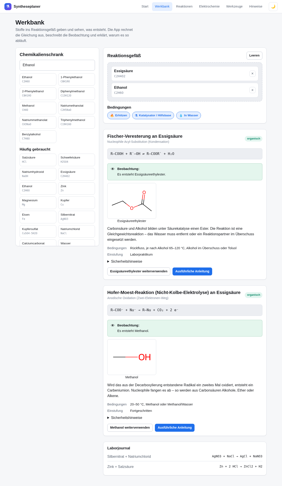
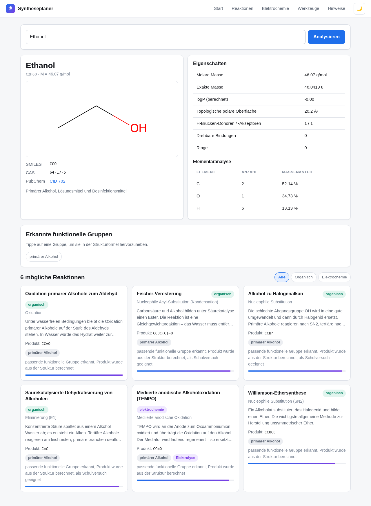

# Syntheseplaner

Eine App für **Windows** und **iPad**, die aus einem eingegebenen Stoff passende
chemische Synthesen und Reaktionen vorschlägt – mit Reaktionsgleichung,
Reaktionsmechanismus, vollständiger Arbeitsanleitung, Sicherheitshinweisen und
elektrochemischen Kennzahlen. Dazu eine **Werkbank**, in der sich Stoffe
zusammengeben lassen und die jedes Ergebnis mit **100 000 belegten Reaktionen aus
der Patentliteratur** abgleicht und Komplexe gleich mit Farbe, räumlichem Bau
und Orbitalschema zeigt, dazu ein Katalog aus **7280 berechneten Synthesen**.



*Werkbank: Essigsäure und Ethanol im Reaktionsgefäß, mit Gleichung, Produktstruktur und Erklärung.*

## Was die App kann

**Werkbank: Stoffe zusammengeben und sehen, was entsteht.**
Im Chemikalienschrank stehen offline 1544 Stoffe bereit – alle natürlich
vorkommenden Elemente, rund 500 Salze, Säuren, Basen und Oxide sowie über 800
organische Stoffe. Die Suche funktioniert wie auf der Startseite: Name, Formel,
CAS-Nummer oder **SMILES**; mit Internet kommen **alle Stoffe aus PubChem** dazu
(über 100 Millionen). Bis zu vier Stoffe wandern ins Reaktionsgefäß, dazu lassen
sich Bedingungen einstellen – **Temperaturregler** (−100 bis 1200 °C),
**Druckregler** (1 mbar bis 300 bar), **säure- oder basenkatalysiert**, Metall-
oder Lewis-Säure-Katalyse, wässrige Lösung, UV-Licht oder Elektrolyse. Erkannt werden Neutralisation, Fällung,
Gasentwicklung, Metallverdrängung, Verbrennung, Thermit- und Knallgasreaktion,
Halogenverdrängung, Nachweisreaktionen (Fehling, Tollens, Iod-Stärke, Berliner
Blau), Komplexbildung und die organischen Reaktionsvorlagen. Die App liefert dann:

- die **ausgeglichene Reaktionsgleichung** und, wo sinnvoll, die Ionengleichung
- die **Beobachtung**: welche Farbe der Niederschlag hat, ob es sprudelt, was man riecht
- eine **Erklärung**, warum die Reaktion so abläuft
- die **Struktur des Produkts**, gezeichnet aus der berechneten Formel
- bei Bedarf den Hinweis, **was noch fehlt** (Wärme, Säure- oder Basenkatalyse, Elektrolysezelle)
- und wenn nichts passiert: **warum** nicht – etwa weil das Metall edler als
  Wasserstoff ist oder alle Ionen in Lösung bleiben

**Für jedes Stoffpaar eine Aussage.** Steht für zwei Stoffe keine Reaktion in
der Datenbank, sagt die Werkbank das Ergebnis voraus – deutlich als
**Vorhersage** gekennzeichnet und mit ihrer **Verlässlichkeit** (hoch, mittel,
gering). Geprüft werden der Reihe nach Redoxreaktionen über die
Standardpotentiale (ΔG = −z·F·ΔE), Protonenübertragungen über pKs-Werte, unedle
Metalle mit Alkoholen oder Phenolen, starke Oxidationsmittel mit organischen
Stoffen und zuletzt das physikalische Verhalten: löst sich, mischt sich, bildet
zwei Phasen oder bleibt ein Feststoffgemenge.

**Temperatur und Druck wirken.** Jeder Stoff im Gefäß zeigt seinen
Aggregatzustand bei den eingestellten Bedingungen (Tabellenwerte, sonst
Joback-Schätzung; Siedepunkte folgen dem Druck nach Clausius-Clapeyron).
Zersetzungen wie das Kalkbrennen laufen erst oberhalb ihrer Temperatur, das
Haber-Bosch-Verfahren verlangt hohen Druck, Gleichgewichte mit Gasen verschieben
sich nach Le Chatelier, und die Geschwindigkeit folgt der RGT-Regel.

Jedes Produkt lässt sich mit einem Tipp als neues Edukt übernehmen, sodass sich
mehrstufige Synthesen durchspielen lassen. Das Laborjournal hält fest, was man
schon probiert hat.

**Belegt oder nur vorhergesagt? Die Werkbank sagt es dir.**
Jedes Ergebnis trägt ein Etikett:

- **✓ Belegt** – genau diese Umsetzung ist in der Literatur beschrieben. Grundlage
  sind 100 000 Reaktionen aus US-Patenten (1976–2016), die tatsächlich im Labor
  durchgeführt wurden. Angezeigt werden Zahl der Fundstellen, der Eintrag im
  Datensatz und die Hilfsstoffe aus der Vorschrift.
- **📘 Lehrbuchreaktion** – fest hinterlegte Standardreaktion, etwa die
  Fehling-Probe mit Glucose oder die Bildung von Berliner Blau.
- **≈ Vorhersage** – aus einer allgemeinen Regel (Säure-Base, Löslichkeit,
  Spannungsreihe) oder einer Reaktionsvorlage berechnet. Chemisch plausibel,
  aber für genau diese Stoffe nicht belegt. Besteht ein Ergebnis nur aus
  Vorhersagen, weist die Werkbank ausdrücklich darauf hin.

Unter dem Ergebnis stehen die **belegten Reaktionen der Stoffe im Gefäß**, für
die noch ein Partner fehlt – mit einem Tipp kommt er ins Gefäß. Auf jeder
Stoffseite steht zusätzlich, **wie der Stoff tatsächlich hergestellt wurde**.

Die Belege sind kein Ersatz für ein Vorhersagemodell: Die Werkbank findet nur
Reaktionen, die so im Datensatz stehen. Der Datensatz wurde automatisch aus
Patenttexten gewonnen; offensichtliche Zuordnungsfehler filtert die App heraus,
einzelne fehlerhafte Einträge können trotzdem vorkommen.

**Komplexe direkt in der Werkbank.**
Gibt man eine Metallquelle und einen Komplexbildner ins Gefäß, erscheint der
entstehende Komplex mit Formel, IUPAC-Namen, Farbe, räumlichem Bau,
d-Orbital-Schema, Magnetismus und Stabilitätskonstante. Das funktioniert mit
allen Stoffen der Datenbank:

- **Metallquellen:** gelöste Salze, schwer lösliche Salze, Hydroxide und Oxide
  (AgCl löst sich in Ammoniak, AgI nicht – berechnet aus lg β und
  Löslichkeitsprodukt) sowie Metalle, sobald etwas im Gefäß sie löst
  (Gold in Königswasser, Zink und Aluminium in Natronlauge, Kupfer in Ammoniak).
- **Liganden:** Anionen von Salzen und Säuren, bekannte Komplexbildner (Ammoniak,
  EDTA, en, Phenanthrolin, Dimethylglyoxim, Oxin, Acetylaceton …) und über die
  Struktur ganze Stoffklassen – Amine, Diamine, Aminosäuren, Pyridine, Phenole,
  Brenzcatechine, 1,3-Dicarbonyle.
- **Chemisch ehrlich:** Redoxreaktionen verhindern Komplexe (Cu²⁺ + I⁻ ergibt
  CuI und Iod), Ammoniak fällt Al³⁺ und Fe³⁺ als Hydroxid, amphotere Hydroxide
  lösen sich im Laugenüberschuss, Chloridokomplexe brauchen konzentrierte Säure,
  und konkurrieren mehrere Liganden, nennt die App den stärksten.
- **Gekennzeichnet:** Bekannte Komplexe gelten als Lehrbuchreaktion, alle anderen
  – nach dem HSAB-Prinzip abgeschätzt – als Vorhersage.

Im Modus **«Komplexe bauen»** der Werkbank lassen sich Komplexe außerdem frei
zusammenstellen: 24 Zentralionen, 31 Liganden, 16 bekannte Vorlagen.

**Reaktions-KI: Was entsteht – und mit welchem Katalysator?**
Ein neuronales Netz, trainiert auf **1.030.272 verschiedenen Reaktionen aus
zehn Datensätzen** – US-Patente 1976–2016, Enzymreaktionen aus BRENDA,
biochemische Reaktionen aus Rhea, PathBank und MetaNetX sowie
Hochdurchsatz-Experimente –, sagt vorher, was aus zwei Stoffen entsteht und
welcher Katalysator, welche Base, welches Reagenz oder welches Enzym dafür
nötig ist. Es kennt 5.953 Reaktionsvorlagen, die es selbst aus den Daten
herausgeschnitten hat, und prüft jedes Produkt mit RDKit. An zurückgehaltenen
Patentreaktionen (USPTO-MIT-Testsatz) liegt das richtige Produkt in 72 % der
Fälle auf Platz 1 und in 81 % unter den ersten drei, bei Enzymreaktionen aus
BRENDA in 50 % bzw. 70 %. Wie das Training lief und wie gut das Netz je Quelle
ist, steht im [Trainingsbericht](docs/KI-TRAININGSBERICHT.md).

Dazu kommt die **Aktivierungsenergie**: Jede Reaktion gehört zu einer Familie mit
Richtwerten für die Barriere ohne und mit Katalysator. Über die
Arrhenius-Gleichung zeigt die App, ob die Reaktion bei der eingestellten
Temperatur abläuft, wie lange man warten müsste und ab welcher Temperatur es
ohne Katalysator ginge – samt Energiediagramm. Ist die Barriere zu hoch, nennt
sie den Katalysator, der die Reaktion möglich macht, und gibt ihn auf Wunsch
direkt ins Gefäß. Für anorganische und technische Katalyse (Haber-Bosch,
Kontaktverfahren, Ostwald-Verfahren, Wasserstoffperoxid-Zerfall mit Braunstein,
Abgaskatalysator, Enzyme wie Katalase und Urease …) gibt es eine eigene
Wissensbasis mit Lehrbuchwerten.

**KI-Synthese: Zielstoff herstellen.** Ein eigener Bereich der Werkbank
(«🎯 KI-Synthese»): Du wählst, was entstehen soll – etwa Paracetamol, Biphenyl
oder Zimtsäure –, und die KI plant rückwärts, wie es sich herstellen lässt. Sie
wendet ihre gelernten Vorlagen vom Produkt zu den Edukten an, lässt nur
chemisch sinnvolle Ausgangsstoffe zu und behält nur Wege, bei denen die
Vorwärtsvorhersage wieder genau den Zielstoff liefert; fehlt ein Ausgangsstoff
im Chemikalienschrank, plant sie eine Vorstufe dazu (bis zu zwei Stufen).

Wie beim Mischen steuerst du dabei einen **Reaktor**: Temperatur- und
Druckregler und den Katalysator – für alle Stufen die KI-Empfehlung oder ohne,
und bei jeder Stufe einzeln umstellbar. Jede Stufe wird sofort unter diesen
Bedingungen bewertet: Läuft sie (mit Halbwertszeit nach Arrhenius), ist sie zu
langsam, fehlt ein Katalysator, siedet ein Edukt aus dem offenen Gefäß (mit
dem nötigen Druck oder dem Hinweis auf den Rückflusskühler), beschleunigt
Überdruck ein gasförmiges Reagenz wie Wasserstoff, oder zersetzen sich die
Stoffe? Dazu kommen Hinweise nach Le Chatelier aus Reaktionsenthalpie und
Gasbilanz. «Empfehlung einstellen» übernimmt Temperatur, Druck und Katalysator
der KI; «Stufe ansetzen» füllt das Reaktionsgefäß mit Ausgangsstoffen und
Hilfsstoffen, übernimmt die Bedingungen und lässt die Werkbank die Reaktion
nachrechnen. Auch von jeder Stoffseite aus erreichbar («Mit KI herstellen»).
Für gesperrte Stoffe plant die App keine Synthese.

**Die Werkbank rechnet mit dem neuronalen Netz.** Beim Mischen sagt die KI für
jedes Stoffpaar im Gefäß die wahrscheinlichsten Produkte voraus, und diese
erscheinen als vollwertige Reaktionen im Ergebnis (🤖 «KI-Vorhersage») – mit
Gleichung, Struktur, Reaktionsenthalpie und Sicherheit der KI. Jede davon wird
wie eine Stufe der KI-Synthese im Reaktor bewertet: bei der eingestellten
Temperatur, dem Druck und dem Katalysator, der im Gefäß ist oder als Katalyse
eingestellt wurde. Läuft sie nicht, steht dabei, was fehlt (zu kalt, Katalysator
fehlt, Reaktionspartner fehlt, Pyrolyse …), und «Empfehlung einstellen» übernimmt
Temperatur, Druck und Katalyse der KI. Dreht man am Temperatur- oder Druckregler
oder wechselt die Katalyse, rechnet die KI sofort neu. Findet schon eine Regel
oder ein Patentbeleg dasselbe Produkt, erscheint die Reaktion nicht doppelt,
sondern mit dem Vermerk «🤖 KI bestätigt». Weitere, weniger sichere Ideen der KI
und Verfahren aus der Katalyse-Wissensbasis stehen darunter.

Eine eigene KI-Seite gibt es nicht mehr – alles läuft in der Werkbank. Dort
stehen im Chemikalienschrank Beispielmischungen («Mit der KI ausprobieren»), und
«So rechnet die Reaktions-KI mit» erklärt Arbeitsweise, Datenquellen, Güte und
Grenzen des Netzes. Das Modell (rund 2,4 MB) arbeitet offline im Gerät.

**Reaktionsenthalpie für jede Reaktion.** Zu jeder Reaktion in der Werkbank,
zu jedem KI-Vorschlag und auf den Reaktionsseiten berechnet die App ΔrH° nach
dem Satz von Hess aus Standardbildungsenthalpien (NBS-Tabellen, CRC Handbook;
rund 340 Stoffe und Ionen) – mit Einordnung als exotherm oder endotherm und
aufklappbarer Rechnung. In wässriger Lösung rechnet sie mit Ionen, so ergibt
jede Neutralisation −55,8 kJ/mol; beim Lösen von Salzen zeigt sie die
Lösungsenthalpie (Ammoniumnitrat kühlt, Natriumhydroxid wärmt). Fehlt ein
organischer Tabellenwert, schätzt sie ihn nach der Gruppenbeitragsmethode von
Joback und kennzeichnet das Ergebnis als geschätzt; Nebenprodukte wie Wasser
oder HCl ergänzt sie selbst, Oxidationen und Reduktionen rechnet sie formal mit
O₂ bzw. H₂. Im Energiediagramm der KI liegen die Produkte auf der berechneten
Höhe. Unter **Werkzeuge → Reaktionsenthalpie** gibt es zusätzlich einen Rechner
für eigene Gleichungen mit Zustandsangaben wie `H2O(l)` oder `Na+(aq)`.

**Synthesekatalog: 7280 Wege zu 2584 Stoffen.**
Für jeden Stoff nachschlagen, wie er hergestellt wird. Der Katalog ist nicht
abgeschrieben, sondern gerechnet: Jede der 83 Reaktionsvorlagen wird auf alle
passenden Stoffe der Datenbank angewendet und das Produkt mit RDKit bestimmt;
die anorganischen Gleichungen entstehen aus dem Ionenmodell und sind exakt
ausgeglichen. Auf jeder Stoffseite stehen deshalb «So wird X hergestellt» und
«X als Ausgangsstoff».



**Stoff eingeben → Reaktionen erhalten.** Name, Summenformel, CAS-Nummer oder
SMILES eingeben. Die App erkennt die funktionellen Gruppen im Molekül und
schlägt dazu passende Reaktionen vor, sortiert nach Passgenauigkeit.

**Produkte werden wirklich berechnet.** Zu jeder Reaktion ist eine
Reaktionsvorschrift als Reaktions-SMARTS hinterlegt. Die App wendet sie mit
RDKit auf die eingegebene Struktur an und zeichnet das Produkt – sie zeigt also
nicht nur ein Lehrbuchbeispiel, sondern *dein* Molekül.

**Anschauliche Anleitungen.** Antippen einer Reaktion öffnet die Detailansicht:

- **Übersicht** – Gleichung als Strukturformel, Reagenzien mit Äquivalenten,
  Bedingungen von der Temperatur bis zur Aufarbeitung, Quellenangaben
- **Anleitung** – nummerierte Arbeitsschritte mit Warnungen und Praxistipps,
  dazu ein Ansatzrechner, der aus der Einwaage alle Reagenzienmengen ableitet
- **Mechanismus** – Teilschritte einzeln gezeichnet, mit beschriebenem
  Elektronenfluss, Zwischenstufen und schematischem Energieprofil
- **Sicherheit** – GHS-Piktogramme, H-Sätze, Schutzausrüstung, Entsorgung
- **Elektrolyse** – bei elektrochemischen Reaktionen: Elektrodenmaterial,
  Stromdichte, Ladungsbedarf in F/mol, Stromausbeute und ein Faraday-Rechner

**Reaktionen suchen.** Volltextsuche über alle Reaktionen mit Filtern nach
Kategorie, funktioneller Gruppe und Einsatzbereich.

**Elektrochemie.** Spannungsreihe mit 65 Halbzellen, Nernst-Rechner,
Zellspannung mit ΔG und Gleichgewichtskonstante, Faradaysche Gesetze und
spezifischer Energiebedarf.

**Werkzeuge.** Reaktionsgleichungen ausgleichen (auch Ionengleichungen mit
Ladungsbilanz), Redoxgleichungen nach der Halbreaktionsmethode in saurem und
basischem Milieu, Oxidationszahlen, Molmassen, Elementaranalyse,
Unterschussreagenz, Ausbeute, Verdünnungen und Maßlösungen, Reaktionsenthalpien
nach Hess.

## Datenbestand

| | |
|---|---|
| belegte Reaktionen (Patentliteratur) | 100 000 |
| davon allein mit Stoffen aus der Datenbank nachstellbar | 2406 |
| berechnete Synthesen (Vorhersagen) | 7280 |
| davon organisch / anorganisch | 4996 / 2284 |
| verschiedene Zielstoffe | 2584 |
| Reaktionstypen mit Mechanismus | 96 |
| davon elektrochemisch | 15 |
| Reaktions-KI: verschiedene Reaktionen / Quellen / Vorlagen | 1.030.272 / 10 / 5.953 |
| Reaktions-KI: richtiges Produkt auf Platz 1 / unter den ersten 3 (Patente) | 72 % / 81 % |
| Katalysierte Prozesse in der Wissensbasis | 27 |
| Standardbildungsenthalpien (anorganisch inkl. Ionen / organisch) | 252 / 85 |
| Stoffe offline verfügbar | 1544 |
| davon von Hand geprüft / systematisch erzeugt | 754 / 790 |
| Zentralionen / Liganden für Komplexe | 24 / 31 |
| Standardpotentiale | 61 |
| erkannte funktionelle Gruppen | 34 |
| Elemente mit Atommassen | 118 |

Darüber hinaus sind alle Stoffe aus **PubChem** abrufbar, sobald eine
Internetverbindung besteht – auf der Startseite ebenso wie im
Chemikalienschrank der Werkbank. Die systematisch erzeugten Stoffe (Elemente,
Salze aus dem Ionenmodell, homologe Reihen, substituierte Benzole,
Aminosäuren, Heterocyclen) entstehen mit `npm run stoffe`; ihre Formeln
berechnet RDKit aus der Struktur.

## Installation

### iPad

1. Die Adresse der App in **Safari** öffnen (nur Safari kann installieren).
2. Auf das **Teilen-Symbol** tippen (Quadrat mit Pfeil nach oben).
3. **«Zum Home-Bildschirm»** wählen.

Die App startet danach im Vollbild und funktioniert offline – inklusive
Strukturberechnung, Reaktionsdatenbank und aller Rechner. Nur die PubChem-Suche
braucht Netz.

### Windows

**Variante 1 – als App aus dem Browser:** Seite in Edge oder Chrome öffnen,
Menü → «Apps» → «Diese Website als App installieren».

**Variante 2 – als Installer:** Der GitHub-Actions-Workflow `build.yml` erzeugt
bei jedem Push eine `.msi` und eine `.exe` als Artefakt; ein Versionstag
(`v1.0.0`) legt zusätzlich eine Veröffentlichung an. Lokal:

```bash
npm install
npm run tauri:build      # Ergebnis in src-tauri/target/release/bundle/
```

Dafür werden [Rust](https://rustup.rs/) und die
[Tauri-Voraussetzungen](https://tauri.app/start/prerequisites/) benötigt.

## Entwicklung

```bash
npm install
npm run dev        # Entwicklungsserver auf http://localhost:5173
npm test           # über 40 000 Tests, davon je über 1000 pro Werkzeug (rund 90 s)
npm run test:massen  # nur die Massentests (src/__tests__/massentests)
npm run lint       # Typprüfung
npm run catalog    # Synthesekatalog neu berechnen (rund 13 s)
npm run reaktionen # Datenbank belegter Reaktionen neu erzeugen (lädt den Datensatz, rund 9 min)
npm run build      # Produktionsbuild nach dist/
```

Rauchtest der gebauten App im Browser:

```bash
npm run build
npx vite preview --port 4173 &
node scripts/smoke-test.mjs
```

## Aufbau

```
src/
  chem/           Fachlicher Kern – ohne Oberflächenbezug, vollständig getestet
    elements.ts       118 Elemente mit Atommassen
    formula.ts        Summenformel-Parser (Klammern, Hydrate, Ladungen)
    balance.ts        Gleichungsausgleich über den Nullraum der Elementmatrix
    fraction.ts       Exakte Bruchrechnung auf BigInt-Basis
    redox.ts          Oxidationszahlen und Halbreaktionsmethode
    electro.ts        Nernst, Zellspannung, Faradaysche Gesetze
    stoichiometry.ts  Ansatzplanung, Unterschuss, Ausbeute, Verdünnung
    ions.ts           Ionenmodell, Löslichkeitsregeln, Spannungsreihe
    inorganicRules.ts Anorganische Reaktionsregeln mit Beobachtungen
    workbench.ts      Werkbank: Was entsteht aus diesen Stoffen?
    organicAcidBase.ts Säure-Base-Reaktionen organischer Stoffe
    specialReactions.ts Nachweise, Komplexbildung, technische Verfahren
    complexes.ts      Komplexe: Namen, Ligandenfeld, Farbe, Stabilität
    complexFormation.ts Welche Komplexe entstehen in der Werkbank?
    prediction.ts     Vorhersage für Stoffpaare ohne hinterlegte Reaktion
    phase.ts          Aggregatzustände, Siedepunkt und Druck, RGT-Regel
    thermo.ts         Reaktionsenthalpie nach Hess, Joback-Schätzung, Ionen in Lösung
    reactionEnthalpy.ts ΔrH° für Werkbank-Reaktionen und Lösungsenthalpien
    conditionEffects.ts Wirkung von Temperatur- und Druckregler
    externalSubstances.ts Stoffe aus PubChem und SMILES für die Werkbank
    ai/               Reaktions-KI: Vorlagen, Netz, Hilfsstoffe, Aktivierungsenergie,
                      Rückwärtssynthese (retrosynthesis.ts), Stufen im Reaktor
                      (synthesisConditions.ts)
    reactionKeys.ts   Strukturschlüssel für den Abgleich mit belegten Reaktionen
    substanceStructures.ts Strukturen auch für Salze und Säuren ohne SMILES
    rdkit.ts          Anbindung der RDKit-WebAssembly-Bibliothek
    reactionEngine.ts Gruppenerkennung, Produktberechnung, Vorschläge
    safety.ts         Reglementierte Stoffe und gefährliche Mischungen
  data/           Wissensdatenbank
    reactions/        Reaktionen nach Stoffklassen getrennt
    substanceTables/  Erweiterte Stofftabellen (generated.ts: erzeugte Stoffe)
    physicalData.ts   Schmelz-, Siede- und Zersetzungstemperaturen
    catalysis.ts      Katalysierte Prozesse mit Aktivierungsenergien
    thermoData.ts     Standardbildungsenthalpien ΔfH° (25 °C, 1 bar)
    generated/        Erzeugter Synthesekatalog (catalog.json)
    functionalGroups.ts  SMARTS-Muster der funktionellen Gruppen
    substances.ts     Offline-Stoffdatenbank
    potentials.ts     Elektrochemische Spannungsreihe
    catalog.ts        Zugriff und Suche im Synthesekatalog
    workbenchSpecs.ts Bedingungen und Katalyse je Reaktionsvorlage
    documentedReactions.ts Laden der belegten Reaktionen (nur benötigte Teile)
  services/       PubChem-Anbindung mit Ratenbegrenzung und Cache
  components/     Wiederverwendbare Bausteine der Oberfläche
  pages/          Die Seiten der App
  __tests__/massentests/  Je über 1000 Tests pro Werkzeug
public/reaktionen/ 100 000 belegte Reaktionen in 2 × 256 Teildateien (gzip, 9 MB)
public/ki/        Modell der Reaktions-KI (Netz und Vorlagen, gzip)
scripts/
  build-catalog.ts  Erzeugt den Synthesekatalog
  build-reactions.ts Erzeugt die Datenbank belegter Reaktionen
  build-substances.ts Erzeugt die erweiterte Stoffdatenbank
  ki/               Training der Reaktions-KI (npm run ki)
  ki/quellen/       Reaktionsquellen laden, Dubletten entfernen, Atomzuordnung (RXNMapper)
src-tauri/        Windows-Anwendung (Tauri v2)
docs/             Fachliche Grundlagen und Entwicklungshinweise
```

Mehr dazu: [Fachliche Grundlagen](docs/CHEMIE.md) ·
[Entwicklungshinweise](docs/ENTWICKLUNG.md)

## Woher die Daten stammen

- **Stoffdaten:** [PubChem](https://pubchem.ncbi.nlm.nih.gov/) (National Library
  of Medicine) über PUG REST und PUG View, ergänzt um eine mitgelieferte
  Offline-Datenbank
- **Strukturberechnung:** [RDKit](https://www.rdkit.org/) als WebAssembly-Modul –
  läuft vollständig auf dem Gerät, es werden keine Strukturen verschickt
- **Reaktionen und Mechanismen:** kuratiert nach Organikum, Clayden *Organic
  Chemistry*, Hollemann-Wiberg, *Ullmann's Encyclopedia of Industrial Chemistry*
  und den bei jeder Reaktion angegebenen Originalarbeiten
- **Belegte Reaktionen:** aus US-Patenten 1976–2016 extrahiert von D. M. Lowe
  (*Chemical reactions from US patents*, CC0), bereinigt und atomzugeordnet von
  W. Jin, C. W. Coley, R. Barzilay und T. Jaakkola (USPTO-MIT, NIPS 2017,
  [github.com/wengong-jin/nips17-rexgen](https://github.com/wengong-jin/nips17-rexgen));
  Auswahl, Plausibilitätsprüfung und Sicherheitsfilter durch
  `scripts/build-reactions.ts`
- **Trainingsdaten der Reaktions-KI:** zusätzlich US-Patenterteilungen
  1976–2016 (D. M. Lowe, CC0; Spiegel von DeepChem), USPTO-STEREO (Schwaller
  et al. 2019), EnzymeMap (Heid et al. 2023, Reaktionen aus BRENDA), ECREACT
  (Probst et al. 2022: BRENDA, Rhea, PathBank, MetaNetX) sowie die
  Hochdurchsatz-Datensätze von Perera et al. (Science 2018, Suzuki) und
  Ahneman et al. (Science 2018, Buchwald-Hartwig); Atomzuordnung mit RXNMapper
  (Schwaller et al. 2021)

## Sicherheit

Die Anleitungen sind **Lern- und Planungsmaterial, keine Freigabe zum
Experimentieren.** Chemische Synthesen gehören in ein dafür eingerichtetes Labor,
mit Gefährdungsbeurteilung, Aufsicht und Absaugung. Verbindlich sind immer die
Sicherheitsdatenblätter der Hersteller und die Regeln der jeweiligen Einrichtung.

Für Stoffgruppen mit ausschließlich schädigender Verwendung – chemische
Kampfstoffe, Explosivstoffe, Betäubungsmittel – zeigt die App bewusst **keine**
Synthesevorschriften. Eigenschaften und Gefahrenhinweise bleiben abrufbar.

## Grenzen

Die Vorschläge beruhen auf Mustererkennung: Die App prüft, ob die passende
funktionelle Gruppe vorhanden ist, und wendet die hinterlegte Vorschrift an. Sie
berücksichtigt weder Sterik noch Schutzgruppen, konkurrierende Gruppen im selben
Molekül oder die tatsächliche Reaktivität. Ein berechnetes Produkt ist ein
Vorschlag, kein Versprechen.

Für die Werkbank heißt das: Findet sie keine Reaktion, ist das **kein Beweis**,
dass nichts passiert – die Datenbank deckt die gängigen Reaktionstypen ab, nicht
jede denkbare Umsetzung. Die Vorhersagen für Stoffpaare beruhen auf
Standardpotentialen, pKs-Werten und Löslichkeitsregeln: Sie sagen, ob eine
Reaktion thermodynamisch möglich ist, nicht, ob sie schnell genug abläuft.
Stoffe aus PubChem tragen deren (meist englische) Namen. Umgekehrt bedeutet ein angezeigtes Produkt nicht, dass
die Reaktion unter beliebigen Bedingungen abläuft; deshalb nennt die App, was an
Wärme, Katalysator oder Apparatur noch fehlt.

Die Reaktions-KI kennt vor allem, was in Patenten der organischen Synthese
häufig vorkommt – rund 96 % ihrer Trainingsreaktionen stammen aus US-Patenten,
nur etwa 4 % aus Enzym- und Stoffwechseldatenbanken. Sie sagt, was chemisch naheliegt – nicht, ob es im Einzelfall klappt,
wie hoch die Ausbeute ist oder welche Nebenprodukte entstehen. Die
Aktivierungsenergien sind Richtwerte der Reaktionsfamilie (± 10–20 kJ/mol), die
Halbwertszeiten Abschätzungen nach Arrhenius. Alles, was die KI liefert, ist als
Vorhersage gekennzeichnet.

Die Reaktionsenthalpie gilt für Standardbedingungen (25 °C, 1 bar) und je
Formelumsatz der angezeigten Gleichung. Tabellenwerte sind auf wenige kJ/mol
genau; nach Joback geschätzte Werte weichen meist um weniger als 10, im Mittel um
etwa 20 kJ/mol ab.
Wo die App Oxidations- oder Reduktionsmittel formal durch O₂ bzw. H₂ ersetzt,
sagt sie das dazu – mit dem echten Reagenz ändert sich der Wert. Für Komplexe
und manche Salze fehlen Tabellenwerte; dann steht dort, welcher Wert fehlt.

Der Synthesekatalog enthält zu jedem Produkt die Wege, die sich aus den
hinterlegten Vorlagen ergeben. Er ist damit vollständig in Bezug auf diese
Vorlagen, nicht in Bezug auf die Literatur: Für viele Stoffe gibt es weitere,
teils bessere Synthesen, die hier fehlen.
